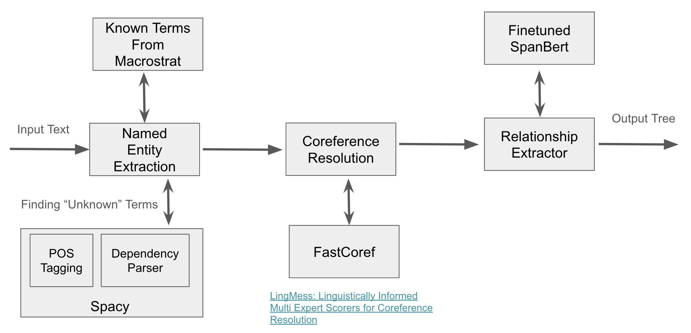

# unsupervised-kg

We explored three different techniques to extract relationships from paragraphs:
- REBEL: We finetuned a pretrained relationship extraction model on our custom dataset
- Seq2rel: It is another relationship extraction model but it supports entity hinting that allows us to indicate what entities we care about
- SpanBERT: This technique seperates entity recognition from relationship extraction. In this approach we utilize a custom technique to determine 
entities we care about and then use a finetuned SpanBERT to predict the relationship between spans in a text. 

This README has the following sections:
- [Setting up the environment](#setting-up-the-environment): Describes how to setup the environment to run all of these models. 
- [Using pretrained models](#using-the-pretrained-model): Describes how to utilize the pretrained models
- [REBEL based knowledge graph extraction](#rebel-based-knowledge-graph-extraction) and [REBEL finetuning](#rebel-finetuning): Described how REBEL works and how we finetuned the model
- [Seq2rel](#seq2rel-training): Describes how we finetuned the seq2rel model
- [SpanBert](#spanbert-based-extraction): Describes how the SpanBERT extraction works and how we trained the model

## Setting up the environment

We have provided a Dockerfile that you can use to setup the environment by running the following commands:  
```
$ export CURRENT_DIR=`pwd`
$ docker build -t unsupervised_kg:latest docker/.
$ docker run --gpus all -d -v $CURRENT_DIR:/working_dir/ --name=unsupervised_kg unsupervised_kg:latest sleep infinity
$ docker exec -it unsupervised_kg bash
$ conda activate unsupervised_kg
```

## Using the pretrained model

In the upcoming sections we are going to be talking about how we trained and finetuned the models mentioned above but we have uploaded the finetuned models to huggingface for easy access. You can use the following commands to use the finetuned versions of all of the models mentioned above: 

For the finetuned REBEL model:
```
$ cd combined_kg
$ python kg_runner.py --file example.txt --save rebel_example.html --model_type rebel --model_path dsarda/rebel_macrostrat_finetuned
```
which will generate a `rebel_example.html` that visualizes the extracted graph `rebel_example.csv` that stored the extracted relationship. 

For the finetuned seq2rel model:
```
$ cd combined_kg
$ python kg_runner.py --file example.txt --save seq2rel_example.html --model_type seq2rel --model_path dsarda/seq2rel_macrostrat_finetuned
```
which will similarily generate a `html` and `csv` file. 

For the finetuned SpanBERT based model:
```
$ cd tree_extraction
$ python tree_generator.py --model_dir dsarda/span_bert_finetuned_model --input_path tree_example.txt --save_path tree_example.json
```
which will save the results to the `tree_example.json` file. 

## REBEL based knowledge graph extraction

To extract relationships from the text corpus, we utilize the REBEL model: [https://github.com/Babelscape/rebel](https://github.com/Babelscape/rebel) which is a seq2sel model for relationship extraction.
In the `rebel_kg` directory, you can use the `kg_runner.py` to generate a knowledge graph for a text corpus. Running `python kg_runner.py --help` you can see the arguments to pass to generate the kg:
```
usage: kg_runner.py [-h] [--directory DIRECTORY] [--file FILE] [--processes PROCESSES] [--num_files NUM_FILES] --save SAVE [--model_type MODEL_TYPE] [--model_path MODEL_PATH]

optional arguments:
  -h, --help            show this help message and exit
  --directory DIRECTORY 
                        The directory containing the text corpus we want to process (default: )
  --file FILE           The file we want to generate the kg for (default: )
  --processes PROCESSES 
                        Number of process we want running (default: 1)
  --num_files NUM_FILES 
                        Number of files in the directory we want to save (default: -1)
  --save SAVE           The html file we want to save the network in (default: None)
  --model_type MODEL_TYPE
                        The type of model we want to use (default: rebel)
  --model_path MODEL_PATH
                        The path to the model weights we want to use (default: Babelscape/rebel-large)
```

Alongside saving the html file, it will also save a csv file representing the knowledge graph in the same directory as the html. An example of running the command for a directory: 
```
$ python kg_runner.py --directory /ssd/dsarda/geoarchive_datasets/filtered_geoarchive_text/ --save /ssd/dsarda/geoarchive_datasets/filtered_results/temp.html --num_files 2 --processes 2`
```
This will use 2 processes to procecess 2 files from the `/ssd/dsarda/geoarchive_datasets/filtered_geoarchive_text/` directory and will save the kg network to `/ssd/dsarda/geoarchive_datasets/filtered_results/temp.html` as well as a csv file representing the kg to `/ssd/dsarda/geoarchive_datasets/filtered_results/temp.csv`

Similarily, to run for the provided example file, you can use the command:
```
$ python kg_runner.py --file example.txt --save example.html
```

Running this script for the sentence "The formation consists of massive and cross-bedded quartz sandstones with ferruginous concretions" produces the knowledge graph:


It also produce the following csv file:
```
src,type,dst,article_id,sentence
Jaguar,country,Canadian,example,"Jaguar is a Canadian-listed junior gold mining, development, and exploration company operating in Brazil with three gold mining complexes and a large land package covering approximately 20,000 ha."
junior,subclass of,mining,example,"Jaguar is a Canadian-listed junior gold mining, development, and exploration company operating in Brazil with three gold mining complexes and a large land package covering approximately 20,000 ha."
Jaguar,product or material produced,gold,example,"Jaguar is a Canadian-listed junior gold mining, development, and exploration company operating in Brazil with three gold mining complexes and a large land package covering approximately 20,000 ha."
```

## REBEL Finetuning

The problem is that REBEL model generally focuses on common terms and ignores terms that are more domain specific. For example, for the sentence:
```
Origins of dolomite in the offshore facies of the Bonneterre Formation
```

This knowledge graph is generated which completely ignores the term dolomite:


Thus, we try to finetune the REBEL model so that it recognizes these terms. The `rebel_finetuning` directory is based on the [original rebel repo](https://github.com/Babelscape/rebel). 

We first generate a finetuning dataset using the Snippets API in `rebel_finetuning/dataset_creator.py` for the edges generated from running `macrostrat_db/database_explorer.ipynb`. We then finetune the dataset using `rebel_finetuning/src/finetune.py` and then convert it to a hugging face model using `rebel_finetuning/src/checkpoint_to_model.py`. To generate the kg using the finetuned model, pass the directory that the model is saved in to `kg_runner.py` using the `model_path` argument. 

Running this for example text, "The formation consists of massive and cross-bedded quartz sandstones with ferruginous concretions.", we get the output knowledge graph:


where the relationships type are custom defined relationships we have included in our training set. 

## Seq2Rel Training

We noticed that even after finetuning that some of the uncommon terms were not being recognized so that we decided to use, [seqrel](https://github.com/JohnGiorgi/seq2rel) which allows us to do entity hinting and specify the term that we care about. We first reformatted the rebel dataset using the `seq_to_rel/create_dataset.py` and then trained the model using `seq_to_rel/training.py`. This well save a `model.tar.gz` to an `output` directory and you can generate a knowledge graph using the command like this:
```
$ python kg_runner.py --file example.txt --save example.html --model_type seq2rel --model_path <path_to_model_zip>
```

where <path_to_model_zip> is the path to the `model.tar.gz` file. Using this on the example setence, "The formation consists of massive and cross-bedded quartz sandstones with ferruginous concretions.", gives us the knowledge graph:


## SpanBERT based extraction

We developed the following system to extract a relationship tree from a given piece of text:



To generate the tree on the example text, run the following command in the `tree_extraction` directory:
```
$ python tree_generator.py --model_dir dsarda/span_bert_finetuned_model --input_path tree_example.txt --save_path tree_example.json
```

## SpanBERT training

We trained the model using the command:
```
$ cd tree_extraction
$ python run_macrostart.py --data_dir <datset_dir> --model spanbert-base-cased --do_train --do_eval --train_batch_size 16 --eval_batch_size 1 --learning_rate 2e-5 --num_train_epochs 1 --max_seq_length 4096 --output_dir <output_dir>
```

where `<dataset_dir>` is a path to the dataset generated either when finetuning REBEL or by the feedback puller tool. The `<output_dir>` is the directory where we want the trained model weights written to.  