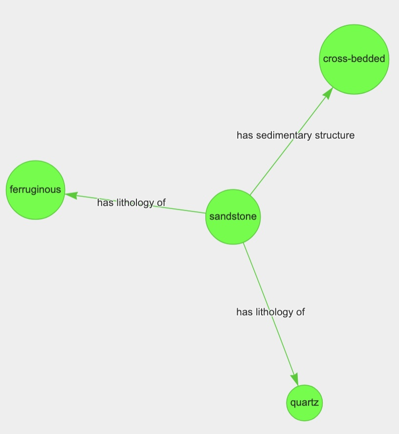

# unsupervised-kg

Here is the current status of the following work:
- Utilize a entity hinting based relationships based extraction to get predefined relationships for entities in the macrostrat database
- Also finetuned the rebel model to perform triplet extraction which doesn’t need predefined relationships
- Created script to link the relationships back to the macrostrat database and write the triplets to predefined schema

In terms of future work, we plan to:
- Create an initial dataset of paragraph level relationships we want to be able to be extract as well define benchmark metrics out of that
- Look into performance of existing models on paragraph level relationships

## Installing the dependencies

We have provided a Dockerfile that you can use to setup the environment by running the following commands:  
```
$ docker build -t unsupervised_kg docker/.
$ docker rm unsupervised_kg
$ CURRENT_DIR=`pwd` && docker run --gpus all -d -v $CURRENT_DIR:/working_dir/ --name=unsupervised_kg unsupervised_kg:latest sleep infinity
$ docker exec -it unsupervised_kg bash
$ conda env create -f environment.yml
$ conda activate unsupervised_kg
```

## Macrostrat DB explorer

The `macrostrat_db/database_explorer.ipynb` contains code to explore the database dump of the macrostrat datbase. It produces two files, a `all_columns.csv` which contains metadata
about all the columns and tables in the `macrostrat` schema and `macrostrat_graph.csv` which contains data for a graph about units metadata extracted from the query:

```
SELECT *
FROM units u
JOIN unit_liths ul
  ON u.id = ul.unit_id
JOIN liths l
  ON l.id = ul.lith_id
 -- Linking table between unit lithologies and their attributes
 -- (essentially, adjectives describing that component of the rock unit)
 -- Examples: silty mudstone, dolomitic sandstone, mottled shale, muscovite garnet granite
JOIN unit_lith_atts ula
  ON ula.unit_lith_id = ul.id
JOIN lith_atts la
  ON ula.lith_att_id = la.id
```

## REBEL based knowledge graph extraction

To extract relationships from the text corpus, we utilize the REBEL model: [https://github.com/Babelscape/rebel](https://github.com/Babelscape/rebel) which is a seq2sel model for relationship extraction.
In the `rebel_kg` directory, you can use the `kg_runner.py` to generate a knowledge graph for a text corpus. Running `python kg_runner.py --help` you can see the arguments to pass to generate the kg:
```
usage: kg_runner.py [-h] [--directory DIRECTORY] [--file FILE] [--processes PROCESSES] [--num_files NUM_FILES] --save SAVE [--model_type MODEL_TYPE] [--model_path MODEL_PATH]

optional arguments:
  -h, --help            show this help message and exit
  --directory DIRECTORY 
                        The directory containing the text corpus we want to process (default: )
  --file FILE           The file we want to generate the kg for (default: )
  --processes PROCESSES 
                        Number of process we want running (default: 1)
  --num_files NUM_FILES 
                        Number of files in the directory we want to save (default: -1)
  --save SAVE           The html file we want to save the network in (default: None)
  --model_type MODEL_TYPE
                        The type of model we want to use (default: rebel)
  --model_path MODEL_PATH
                        The path to the model weights we want to use (default: Babelscape/rebel-large)
```

Alongside saving the html file, it will also save a csv file representing the knowledge graph in the same directory as the html. An example of running the command for a directory: 
```
$ python kg_runner.py --directory /ssd/dsarda/geoarchive_datasets/filtered_geoarchive_text/ --save /ssd/dsarda/geoarchive_datasets/filtered_results/temp.html --num_files 2 --processes 2`
```
This will use 2 processes to procecess 2 files from the `/ssd/dsarda/geoarchive_datasets/filtered_geoarchive_text/` directory and will save the kg network to `/ssd/dsarda/geoarchive_datasets/filtered_results/temp.html` as well as a csv file representing the kg to `/ssd/dsarda/geoarchive_datasets/filtered_results/temp.csv`

Similarily, to run for the provided example file, you can use the command:
```
$ python kg_runner.py --file example.txt --save example.html
```

Running this script for the sentence "The formation consists of massive and cross-bedded quartz sandstones with ferruginous concretions" produces the knowledge graph:


It also produce the following csv file:
```
src,type,dst,article_id,sentence
Jaguar,country,Canadian,example,"Jaguar is a Canadian-listed junior gold mining, development, and exploration company operating in Brazil with three gold mining complexes and a large land package covering approximately 20,000 ha."
junior,subclass of,mining,example,"Jaguar is a Canadian-listed junior gold mining, development, and exploration company operating in Brazil with three gold mining complexes and a large land package covering approximately 20,000 ha."
Jaguar,product or material produced,gold,example,"Jaguar is a Canadian-listed junior gold mining, development, and exploration company operating in Brazil with three gold mining complexes and a large land package covering approximately 20,000 ha."
```

### Upload to Neo4j

To upload to Neo4j, we need to have a txt containing the following information:
```
NEO4J_URI=<uri>
NEO4J_USERNAME=<username>
NEO4J_PASSWORD=<password>
```
This information is generally provided by Neo4j. In the example below, we assume that this information is stored in `neo4j_login.txt`.

To upload the csv file produced by `kg_runner`, in this case `example.csv`, you can use the `neo4j_uploader` code as such:
```
$ python neo4j_uploader.py --login_file neo4j_login.txt --graph_file example.csv
```

## REBEL Finetuning

The problem is that REBEL model generally focuses on common terms and ignores terms that are more domain specific. For example, for the sentence:
```
Origins of dolomite in the offshore facies of the Bonneterre Formation
```

This knowledge graph is generated which completely ignores the term dolomite:


Thus, we try to finetune the REBEL model so that it recognizes these terms. The `rebel_finetuning` directory is based on the [original rebel repo](https://github.com/Babelscape/rebel). 

We first generate a finetuning dataset using the Snippets API in `rebel_finetuning/dataset_creator.py` for the edges generated from running `macrostrat_db/database_explorer.ipynb`. We then finetune the dataset using `rebel_finetuning/src/finetune.py` and then convert it to a hugging face model using `rebel_finetuning/src/checkpoint_to_model.py`. To generate the kg using the finetuned model, pass the directory that the model is saved in to `kg_runner.py` using the `model_path` argument. 

Running this for example text, "The formation consists of massive and cross-bedded quartz sandstones with ferruginous concretions.", we get the output knowledge graph:



where the relationships type are custom defined relationships we have included in our training set. 

## Seq2Rel Training

We noticed that even after finetuning that some of the uncommon terms were not being recognized so that we decided to use, [seqrel](https://github.com/JohnGiorgi/seq2rel) which allows us to do entity hinting and specify the term that we care about. We first reformatted the rebel dataset using the `seq_to_rel/create_dataset.py` and then trained the model using `seq_to_rel/training.py`. This well save a `model.tar.gz` to an `output` directory and you can generate a knowledge graph using the command like this:
```
$ python kg_runner.py --file example.txt --save example.html --model_type seq2rel --model_path <path_to_model_zip>
```

where <path_to_model_zip> is the path to the `model.tar.gz` file. Using this on the example setence, "The formation consists of massive and cross-bedded quartz sandstones with ferruginous concretions.", gives us the knowledge graph:


